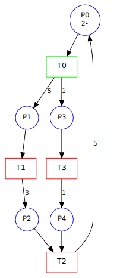
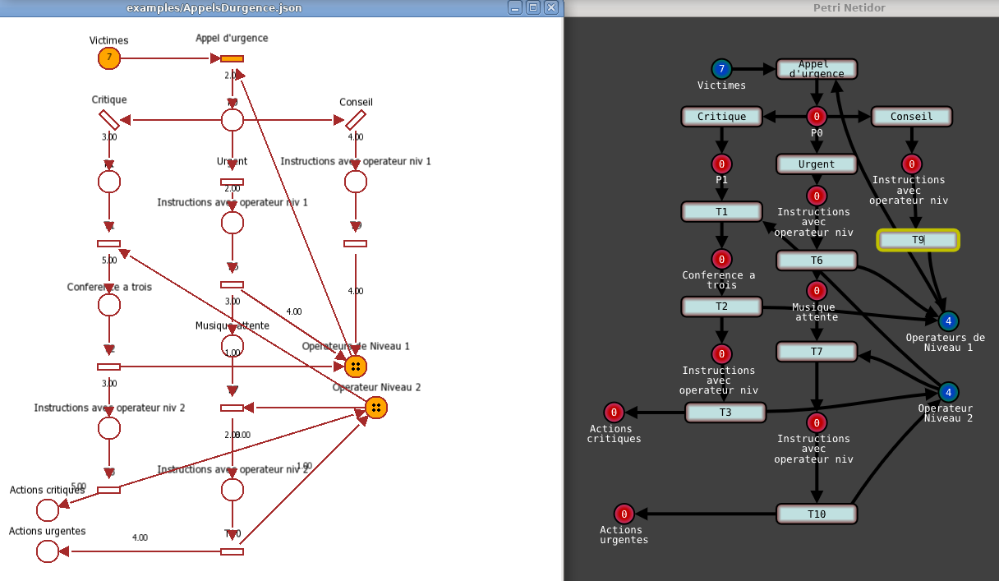

# Exporting the net

## Export to LaTeX

The Petri net can be exported to a LaTeX file. The application will
ask you where to save the file. For LaTex a `.tex` file is created, and you can compile
it with a command like `latex LateX-gen.tex; dvipdf LateX-gen.dvi`.

*Fig 4 - Canonical Event Graph exported in LaTex.*

You have to install an application for example for Linux:
`sudo apt-get install texlive-base`.

## Export to Graphviz

The Petri net can be exported to a Graphviz file. The application will
ask you where to save the file. For LaTex a `.dot` file is created.

You have to install an application for example for Linux:
`sudo apt-get install xdot`.

*Fig 5 - Canonical Event Graph exported in Graphviz.*

## Export to Draw.io

Can export to input files for [Draw.io](https://app.diagrams.net).

## Export to Symfony workflow

Can export to input files for [Symfony workflow](https://symfony.com/doc/current/components/workflow.html).

## Export to pn-editor

Can export to input files for [pn-editor](https://gitlab.com/porky11/pn-editor).

You have to git clone and install it manually.

## Export to C++ code

If your net is a GRAFCET (GRAphe Fonctionnel de Commande Etapes-Transitions in French,
aka Sequential Function Chart (SFC) in English) you can generate the C++ code.
More details [here](grafcet.md).